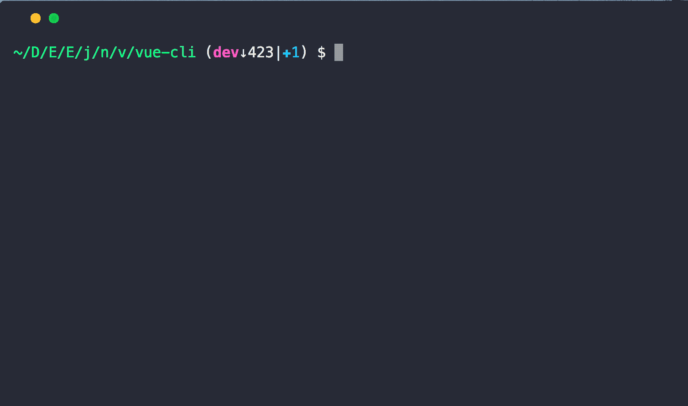

# node-modules-size [](https://travis-ci.org/chinanf-boy/node-modules-size) [](https://codecov.io/gh/chinanf-boy/node-modules-size?branch=master)
> cli to show node_modules size

[中文](./readme.md) | ~~[english](./readme.en.md)~~

## Install

```
npm i -g node-modules-size
```

```
node-modules-size
```



## Usage

```js
const nodeModulesSize = require('node-modules-size');

let res = await nodeModulesSize();
//=> {"node_modules - path": "kB", //.. , "total":"size"}
```

## API

### nodeModulesSize(cwd)

#### cwd

name: | cwd
---------|----------
Type: | `string`
Default: | `process.cwd()`
Desc: | dir context

## CLI

```
npm install --global node-modules-size
```

```
$ node-modules-size --help

  Usage
    node-modules-size [cwd]
```

## use

- [two-log](https://github.com/chinanf-boy/two-log) 我只需要两种信息输出方式

## License

MIT © [chinanf-boy](http://llever.com)
