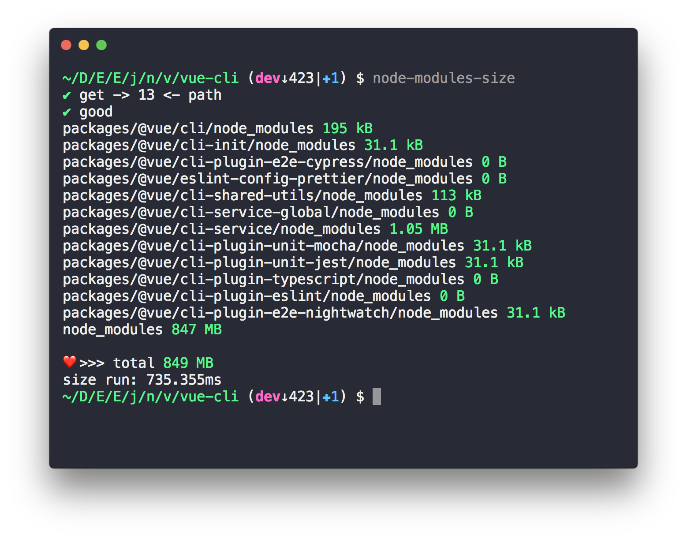

# node-modules-size [](https://travis-ci.org/chinanf-boy/node-modules-size) [](https://codecov.io/gh/chinanf-boy/node-modules-size?branch=master)
> cli to show node_modules size

[ list with project size ](https://github.com/chinanf-boy/node-modules-size-snapshot)

## Install

```
npm i -g node-modules-size
```

```
node-modules-size
```

> vue-cli project demo



> more [ project size like ava ... ](https://github.com/chinanf-boy/node-modules-size-snapshot)


## Usage

```js
const nodeModulesSize = require('node-modules-size');

let res = await nodeModulesSize();
//=> {"node_modules - path-name": "number-size", //.. , "total":"size"}
```

> you can use module(`pretty-bytes`) to convert the number-size to human(kB) size.

## API

### nodeModulesSize(cwd, options)

#### cwd

name: | cwd
---------|----------
Type: | `string`
Default: | `process.cwd()`
Desc: | dir context

#### options

##### match

name: | match
---------|----------
Type: | `string`\|`Array`
Default: | `*node_modules`
Desc: | match path use Array.prototype.every

##### ignore

name: | ignore
---------|----------
Type: | `string`\|`Array`
Default: | `*.git`
Desc: | ignore path use Array.prototype.some


## CLI

```
npm install --global node-modules-size
```

```
$ node-modules-size --help

  Usage
    node-modules-size [cwd] [Options]

	Options

		-P default:<process.cwd()> select and picture save

		{ use bash:"screencapture -W -P" select and save the picture}

		-m match  :  < *node_modules >

		{ -m "*node_modules,*" match is Array.prototype.every for path cover options}

		-i ignore  :  < *.git >

		{ -i "*.git" ignore is Array.prototype.some for path cover options}

```

## use

- [two-log](https://github.com/chinanf-boy/two-log) 我只需要两种信息输出方式
- [what-time](https://github.com/chinanf-boy/what-time) human readable time
- [get-module-name](https://github.com/chinanf-boy/get-module-name) just get process.cwd around package.json name
- [get-node-modules-rust](https://github.com/chinanf-boy/get-node-modules-rust) use Rust power, search the Given dir of all node_modules folder.

<a href="https://patreon.com/yobrave">

</a>

## License

MIT © [chinanf-boy](http://llever.com)
